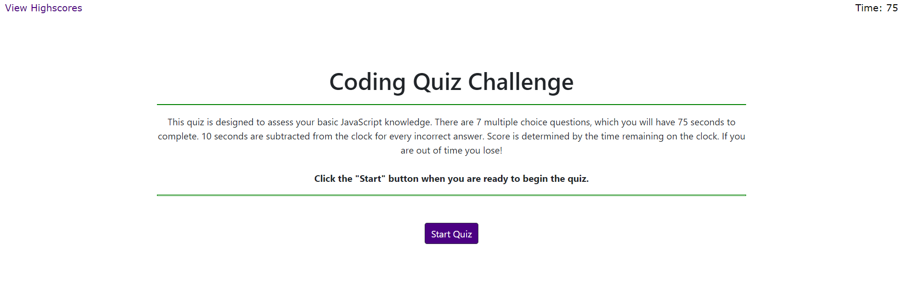

Code Quiz 

## Funtionality 

This quiz game is designed to assess basic JavaScript knowledge. There are 7 multiple choice questions which have time limit of 75 seconds to complete. 10 seconds are subtracted from the clock for every incorrect answer. Score is determined by the time remaining on the clock. If you are out of time you lose! On completion the scores are saved on the local database and users can be ranked high to low.

## Mock-Up

The following animation demonstrates the application functionality:

